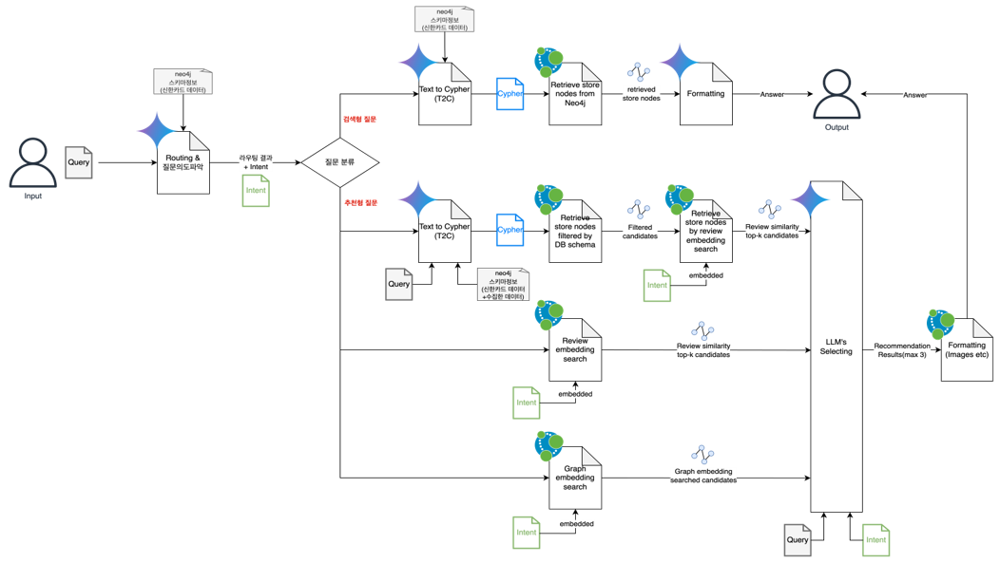
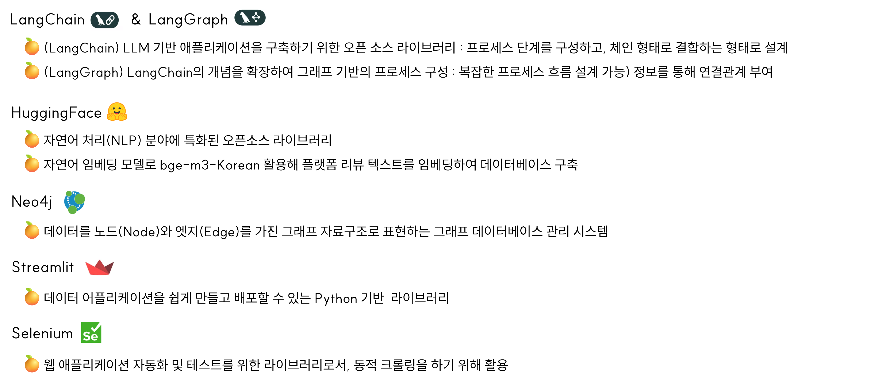
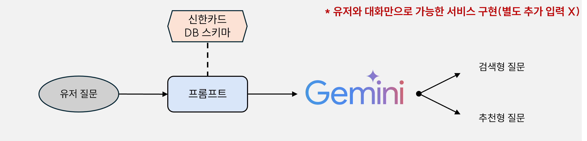
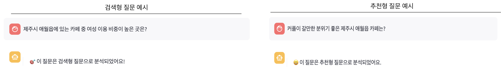
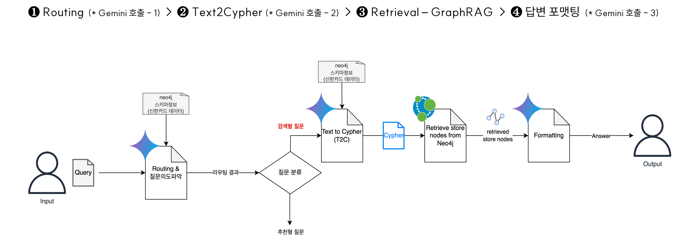
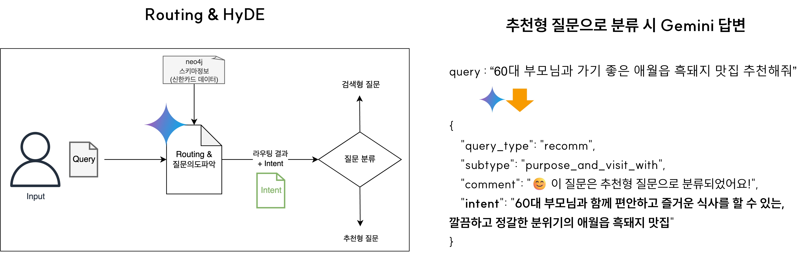

# 여행그룹 유형과 연령을 고려한 제주도 맛집 추천
> python 3.10 이상
> 제주 맛집 추천 챗봇 : <https://jeju-llmrec.streamlit.app/>
- **기획 목적** : 제주도를 방문하는 여행 그룹 유형과 연령대에 따라 각기 다른 식당 및 메뉴 선호가 존재, 이를 반영한 세분화된 추천이 필요 
  - 여행 구성원과 연령대에 따라 메뉴와 식당 선택 시 우선적으로 고려되는 사항이 다르므로 맛집 추천도 이를 고려해야 함
  - 구성원과 연령에 적합한 조건을 추론하여 유저 세그먼트별 최적화된 추천으로 서비스 효용성 증대


- **서비스 제안** : 여행 그룹 유형와 연령대에 적합한 조건을 추론하여, 유저 세그먼트별 최적화된 답변을 제공하는 추천 서비스 구현 
  - LLM(Gemini)의 강점을 활용 : 유저 질문의 의도를 가상으로 추론하여 RAG를 통한 답변이 가능함(HyDE)
  - 외부 데이터(리뷰 플랫폼 데이터) 수집 : 음식점 방문 정보(리뷰, 평점, 동반자 정보 등), 음식점 이미지 기반으로 유저에게 충분한 정보 제공
  - 특히, 리뷰와 동반자 정보를 활용해 유저의 여행그룹 유형과 연령대를 고려한 추천을 구현 
  - 데이터베이스에서 유저 의도를 고려한 추천이 가능하도록 다양한 방법론(Vector Search, Text2Cypher, Graph embedding Search) 적용

## DB SCHEMA

<p align="center">

</p>

## Pipeline


## Data Load
### 네이버, 카카오, 구글 플랫폼 별로

1. 사진(URL)
2. 리뷰 데이터(100개 미만)
  - 네이버 - 방문자리뷰(개수)
  - 카카오맵 - 후기(개수)
  - 구글 - 개수
3. 별점 정보

### + 추가적인 정보 활용

- 네이버 : 예약 여부 정보, 방문 목적 정보, 대기 시간 정보, 방문 동반자 정보, 가맹점 메뉴 정보, 가맹점 좌표 정보
- 카카오맵 : 편의시설 정보

## Method
### GraphRAG
- 데이터의 연결성을 활용하여 유저 질문에 대한 유연하고 정확한 응답이 가능하도록 **GraphRAG** 방식 선택

- 구조화된 지식 그래프를 통해 LLM의 할루시네이션 현상 감소
  - 단순히 유저 쿼리와 유사한 텍스트를 찾는 것이 아닌 **구조화된 지식 검색**으로 정확하고 풍부한 답변 생성이 가능(그래프의 연결관계 활용)
  - **Explainable**(reasoning) 관점에서 어떠한 연결 관계를 통해 왜 그러한 정보들이 증강되어 검색되었는지를 역추적

- **GraphDB** : GraphRAG 활용에 용이한 **Neo4j** 선택


### 활용 라이브러리


### Router
- 유저 질문은 검색형 또는 추천형으로 구분될 수 있으므로, LLM이 질문의 의도와 맥락을 구분할 수 있도록 라우팅 기법을 사용  
  - 신한카드 데이터 기준으로 정보 검색 가능한지 여부를 추론 : 검색이 가능하면 검색형, 다른 정보도 필요하면 추천형으로 분류 
  - 유저 질문을 분류한 예제를 포함한 프롬프트 구성





### 검색형 질문

#### 프로세스


#### 쿼리 기준
- 특정 연월 - 포함시 : 해당 연월 기준
- 특정 연월 - 미포함시
  - 수치형 변수 : 연월 "평균값" 기준 (avg) 
  - 범주형 변수 : 연월 "마지막 값" 기준 (collect)


### 추천형 질문
#### 프로세스

#### 질문 의도 파악
- Query 입력되면 Gemini는 Few shot prompting에 의해 유저의 의도를 파악
  - 유저의 의도는 “intent”라는 키에 해당하는 value로 반환되도록 지시
  - 예를 들어, “60대 부모님과 가기 좋은 애월읍 흑돼지 맛집 추천해줘”라는 질문을 입력
  - Gemini는 질문의 의도를 여행 구성원, 연령대를 기반으로 분석하여 오른쪽 예시와 같은 intent를 반환


## Streamlit
```
streamlit run app.py
```
